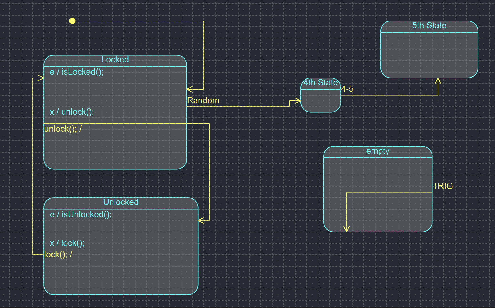

# Converting QM to Proteus

## Table of Contents

1. [Introduction](#introduction)
2. [Installation](#installation)
3. [Usage](#usage)

## Introduction
This repository aims to provide a guide on how to convert the QM Modeling diagrams into Proteus.
#### What is QM Modeling?
QM Modeling is a visual modeling tool that provides a user-friendly graphical interface to map out the flow and behavior of the state machines.
#### What is Proteus?
Proteus is a programming language that provides a textual representation of the diagrams represented in QM Modeling.

## Installation

To begin converting QM concepts to Proteus, you'll first need to have QM Modeling and Proteus installed on your system. 
- To download and install QM Modeling from the official [QM™ Model-Based Design Tool](https://www.state-machine.com/products/qm) 
- To download and install [Proteus](https://github.com/nasa/PROTEUS)

## Usage

Once you have QM™ Model-Based Design Tool and Proteus installed, you can start converting state machines into Proteus. 
### Demo
- Create the state machine in QM™ Model-Based Design Tool
  
- Make sure the state machine is saved as *statemachine.qm* and in the same folder with the program
- Run [*main.py*](main.py) in your CMD Prompt
- Output in CMD Prompt:
  
- A file called [*output.proteus*](output.proteus) will be created and it's the proteus code in correlation to the state machine diagram.
- Example of file output:
  
  

## Limitations
- Only supports linear state machines
- Does not manage guard conditions
- Allows conversion from QM to Proteus, but not Proteus to QM

 

